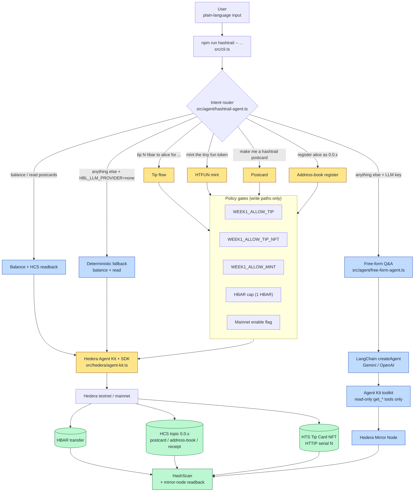
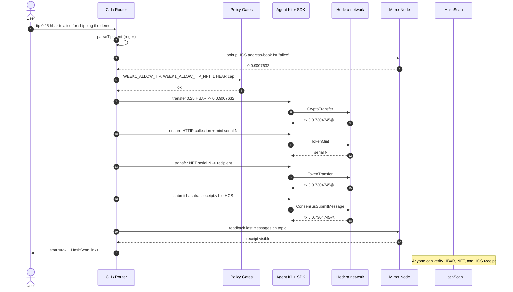

# HashTrail

HashTrail is a Hedera receipt agent for verifiable contributor rewards.

Give it a plain-language instruction such as `tip 0.25 hbar to alice for
shipping the demo` and it leaves a public proof trail: an HBAR transfer, an
HCS receipt, an optional HTS Tip Card NFT, and HashScan links for every
on-chain object.

The design goal is simple: an AI agent should not just *claim* it completed
a payment. It should leave a receipt anyone can inspect later.

This is not a payroll system or a treasury product. It is a narrow agent for
small teams, hackathon operators, DAO contributors, and community admins who
want an auditable "I paid this person for that work" trail.

## Live Mainnet Proof

HashTrail has completed a real mainnet run with a renderable `HTTIP` NFT.

| Object               | ID                                                    |
| -------------------- | ----------------------------------------------------- |
| Operator             | `0.0.10489896`                                        |
| Recipient / NFT owner| `0.0.10231006`                                        |
| HCS topic            | `0.0.10489911`                                        |
| Tip Card collection  | `0.0.10489912` (serial `1`)                           |
| HBAR tip tx          | `0.0.10489896@1779477337.887190474`                   |
| NFT mint tx          | `0.0.10489896@1779477432.744595352`                   |
| NFT transfer tx      | `0.0.10489896@1779477440.269786908`                   |
| HCS receipt tx       | `0.0.10489896@1779477441.554100712`                   |
| Metadata             | `ipfs://bafkreiblekqyyf6di5ksmwyr45aoopvrbzxbunhywbm7ffnh4zcdeqcifi` |

Browse on HashScan: [topic](https://hashscan.io/mainnet/topic/0.0.10489911) ·
[NFT collection](https://hashscan.io/mainnet/token/0.0.10489912) ·
[HBAR tip](https://hashscan.io/mainnet/tx/0.0.10489896@1779477337.887190474) ·
[HCS receipt](https://hashscan.io/mainnet/tx/0.0.10489896@1779477441.554100712) ·
[metadata JSON](https://ipfs.io/ipfs/bafkreiblekqyyf6di5ksmwyr45aoopvrbzxbunhywbm7ffnh4zcdeqcifi).

Mirror node confirmed serial `1` of `0.0.10489912` is owned by
`0.0.10231006` and the serial metadata decodes to the IPFS URI above. Operator
notes live in [`submission/mainnet-readiness.md`](submission/mainnet-readiness.md).

## Architecture



Yellow paths are gated writes. Blue paths are read-only. Green nodes are the
public artifacts anyone can verify.

The router in [`src/agent/hashtrail-agent.ts`](src/agent/hashtrail-agent.ts)
resolves intent in this order: address-book register → tip → mint → balance/read
→ explicit postcard → free-form Q&A (LLM configured) → deterministic balance/read
fallback (`HBL_LLM_PROVIDER=none`). The Agent Kit boundary lives in
[`src/hedera/agent-kit.ts`](src/hedera/agent-kit.ts) and wires three local
controls onto every Agent Kit tool call: a mint allowlist, a 1 HBAR transfer
cap, and a JSON audit-log hook.

Stack: `@hashgraph/hedera-agent-kit@4`, `@hashgraph/hedera-agent-kit-langchain`,
`@hiero-ledger/sdk`, LangChain (Gemini or OpenAI adapters), and the Hedera
mirror node for readback. Toolkit plugins: `coreAccountQueryPlugin`,
`coreConsensusPlugin`, `coreConsensusQueryPlugin`, `coreTokenPlugin`,
`coreTokenQueryPlugin`, `coreTransactionQueryPlugin`, `coreMiscQueriesPlugin`.

### Tip flow sequence

What happens when the user runs
`npm run hashtrail -- "tip 0.25 hbar to alice for shipping the demo"`:



## Quickstart

Requirements: Node.js `>=20`, a Hedera testnet operator account, and
optionally a Gemini or OpenAI API key for free-form Q&A.

```bash
npm install
cp .env.example .env
# fill in HEDERA_OPERATOR_ID, HEDERA_OPERATOR_KEY, optional GEMINI_API_KEY
npm run typecheck && npm run lint && npm test -- --run && npm run build
npm run hashtrail -- "make me a hashtrail postcard"
```

A minimal testnet `.env`:

```dotenv
HEDERA_NETWORK=testnet
HASHTRAIL_ENABLE_MAINNET=false
HEDERA_OPERATOR_ID=0.0.xxxxx
HEDERA_OPERATOR_KEY=REPLACE_ME
HEDERA_MIRROR_NODE_URL=https://testnet.mirrornode.hedera.com

# Set HBL_LLM_PROVIDER=none to disable free-form Q&A and run deterministic-only.
HBL_LLM_PROVIDER=gemini
HBL_LLM_MODEL=gemini-2.5-flash
GEMINI_API_KEY=REPLACE_ME

HASHTRAIL_DISPLAY_NAME=ihab
HASHTRAIL_HCS_TOPIC_ID=
HASHTRAIL_HTS_TOKEN_ID=
HASHTRAIL_NFT_TOKEN_ID=
HASHTRAIL_TIP_CARD_METADATA_URI=

WEEK1_ALLOW_MINT=true
WEEK1_ALLOW_TIP=true
WEEK1_ALLOW_TIP_NFT=true
```

For mainnet, also set `HEDERA_NETWORK=mainnet`,
`HASHTRAIL_ENABLE_MAINNET=true`, the mainnet mirror node URL, and never reuse
testnet topic/token IDs. Operational walkthrough lives in
[`submission/mainnet-readiness.md`](submission/mainnet-readiness.md).

Never commit `.env`, `.local/`, or generated recipient keys.

## Commands

Deterministic write commands (gated by the policy flags):

```bash
npm run hashtrail -- "make me a hashtrail postcard"
npm run hashtrail -- "check my balance and read the last 3 postcards"
npm run hashtrail -- "mint the tiny fun token"
npm run hashtrail -- "tip 0.25 hbar to alice for shipping the demo"
```

Address-book management:

```bash
npm run hashtrail -- recipients create alice --note "demo recipient"
npm run hashtrail -- recipients add alice 0.0.xxxxx --note "demo recipient"
npm run hashtrail -- recipients publish alice
```

The tip command accepts a published HCS alias, a local `recipients.json`
fallback alias, or a raw `0.0.x` account id.

Free-form Q&A (requires `HBL_LLM_PROVIDER=gemini` or `openai`):

```bash
npm run hashtrail -- "what is the hcs topic id for the last transactions and show me the last 3 messages"
npm run hashtrail -- "look up token info for 0.0.9007634 and tell me the name, symbol, and total supply"
```

Free-form input is filtered to read-only Hedera Agent Kit `get_*` tools
(`get_hbar_balance_query_tool`, `get_topic_messages_query_tool`,
`get_token_info_query_tool`, `get_transaction_record_query_tool`,
`get_exchange_rate_tool`, ...). The LLM never sees a write tool, so a Q&A
question can never spend HBAR or mint an NFT.

## Address Book

HashTrail resolves a recipient alias in this order: HCS address-book receipts
first (public, inspectable), then local `recipients.json` (gitignored, useful
for bootstrap). `recipients create <alias>` generates a Hedera account and
stores the private key under `.local/recipients/`. `recipients publish <alias>`
writes a `hashtrail.address-book.v1` receipt to HCS so other operators can
resolve the same alias from the public log.

## Tip Card NFT

The canonical Tip Card asset is
[`assets/tip-card/tip-card-v1.svg`](assets/tip-card/tip-card-v1.svg). For
wallet and marketplace rendering, mint with a public HIP-412 metadata URI:

```dotenv
HASHTRAIL_TIP_CARD_METADATA_URI=ipfs://REPLACE_WITH_METADATA_CID
```

Three metadata variants live under `assets/tip-card/`. For production-style
cards, prefer
[`metadata.hip412.svg-default.json`](assets/tip-card/metadata.hip412.svg-default.json):
the generic SVG is the default wallet image, so the visible NFT shows
`HBAR TIP`, `HCS RECEIPT`, `HTS NFT`, and `HASHSCAN PROOF` without binding the
art to a single amount or recipient.

If a recipient cannot accept the NFT, the HBAR tip can still complete and the
HCS receipt records the NFT outcome and reason.

## Safety Model

- Mainnet writes require `HASHTRAIL_ENABLE_MAINNET=true` plus the matching
  `WEEK1_ALLOW_*` flag for each action (`MINT`, `TIP`, `TIP_NFT`).
- Agent Kit HBAR transfer tools are capped at 1 HBAR per call.
- NFT metadata URIs must be `ipfs://`, `ar://`, or `https://` and fit Hedera's
  100-byte serial metadata limit.
- Free-form Q&A only ever sees read-only Agent Kit `get_*` tools.
- Readback commands reuse pinned topic/token IDs instead of creating new
  objects.
- Secrets and generated keys are gitignored.

## Verification

```bash
npm run typecheck
npm run lint
npm test -- --run
npm run build
npm run secrets:scan
```

Reviewer-facing artifacts:

- [`submission/demo-testnet-transcript.md`](submission/demo-testnet-transcript.md)
- [`submission/mainnet-readiness.md`](submission/mainnet-readiness.md)

## Releases

See [`CHANGELOG.md`](CHANGELOG.md) for the version history. Tagged releases
live on [GitHub](https://github.com/Hebx/hashtrail-hedera-agent/releases).

## Contributing

Issues and pull requests are welcome.

1. Fork and create a feature branch off `main`.
2. Run `npm run typecheck && npm run lint && npm test -- --run && npm run build && npm run secrets:scan` before opening a PR.
3. Use [Conventional Commits](https://www.conventionalcommits.org/) for commit
   subjects (`feat:`, `fix:`, `docs:`, `ci:`, etc.).
4. For changes that affect on-chain behavior, include a short note about which
   policy gate (or test) covers the new path.

CI runs typecheck, lint, vitest, and gitleaks on every PR (Node 20 and 22).
Secrets must never land in commits — use `.env.example` for shape and keep
real values in `.env`, which is gitignored.

## License

[MIT](LICENSE) © Ihab Heb (Hebx)
